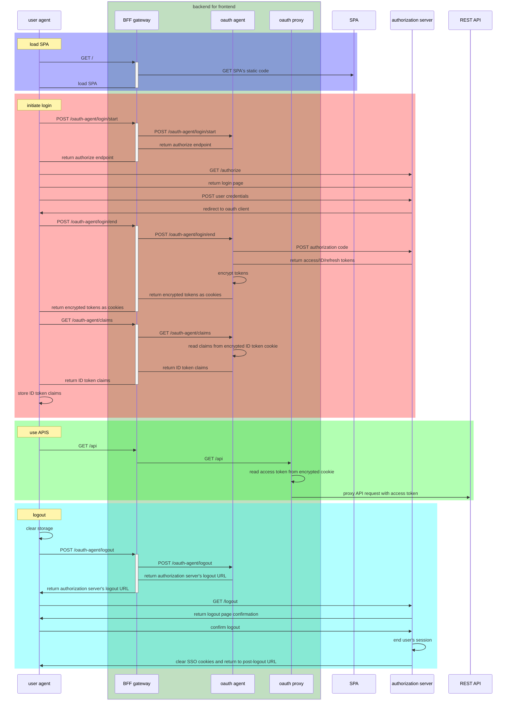

# Angular directory architecture
### src directory
- `index.html` is the app's top level HTML template.
- `style.css` is the app's top level style sheet.
- `main.ts` is where the app start running.
- `favicon.ico` is the app's icon, just as you would find in any web site.
#### app directory
- `app.component.ts` is the source file that describes the app-root component. This is the top-level Angular component in the app. A component is the basic building block of an Angular application. The component description includes the component's code, HTML template, and styles, which can be described in this file, or in separate files.
- `app.component.css` is the style sheet for this component.
- New components are added to this directory.
#### assets directory
contains images used by the app.
### node_modules
has the node.js packages that the app uses.
### e2e
has files used to test the app.
### other files
- `angular.json` describes the Angular app to the app building tools.
- `package.json` is used by npm (the node package manager) to run the finished app.
- `tsconfig.*` are the files that describe the app's configuration to the TypeScript compiler.

# Commands
## Angular
### new 
Create a local workspace and install necessary npm dependencies into the local `node_modules` directory.
`ng new my-app`
### serve
Spin up a local server serving the local directory. The application will automatically reload if you change any of the source files.
`ng serve`
### generate
generate new component files into the `src/app` directory:  
`ng generate component home --standalone --inline-template --skip-tests`
generate a new interface into the `src/app` directory:
`ng generate interface housinglocation`
generate a housing service
`ng generate service housing --skip-tests`
## NPM
### install
`npm install` install the required dependencies into the local `node_modules` directory.
## Podman
### build
`podman build . -t angular:latest`
### run
First run the following dependencies (stop with `podman play kube pod.yml --down`):
- `podman play kube keycloak/pod.yml --net foo` to run the authorization server
- `podman play kube rest-api/pod.yml --net foo` to run the REST API secured by the authorization server.
- `./bff/oauth-agent/gradlew -p ./bff/oauth-agent/ bootJar` to build the spring-boot service and `podman play kube bff/pod.yml --net foo --context-dir=./bff --build=true` to build and run the BFF image or simply `podman play kube bff/pod.yml --net foo` if images are already built

`podman run --rm -d --name spa --net foo -v ${PWD}/src:/my-app/src angular:latest ng serve --host 0.0.0.0 --disable-host-check --configuration development`  
### develop
Invoke Angular CLI from a container by prefixing commands with `podman run --rm -v ${PWD}:/my-app angular:latest `

# architecture
